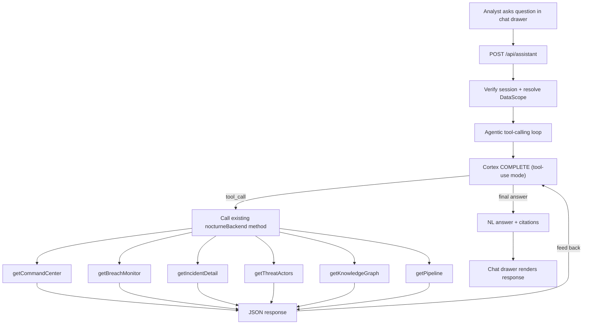

# Natural Language Assistant for the Command Center

## Context

The dashboard already fetches all its data through `nocturneBackend` methods in `src/server/nocturne-backend.ts` — each takes a `DataScope` argument that enforces tenant isolation. The AI assistant simply **wraps these same functions as LLM tools** and uses Cortex COMPLETE to interpret questions + format answers from the returned JSON.

No new Snowflake objects, no semantic view, no generated SQL, no new data access path. The assistant shows exactly what the UI already shows, just presented conversationally.

### Architecture



### How it works

1. Analyst types a question (e.g., "Which incidents have financial leak types?")
2. The backend sends the question + tool definitions to Cortex COMPLETE
3. The model decides which existing backend function to call (e.g., `getBreachMonitor`)
4. The backend calls that function **with the verified DataScope** (same scope enforcement every UI page uses)
5. The JSON result is fed back to the model
6. The model filters/summarizes/formats the data into a natural-language answer
7. If needed, the model may call multiple tools in sequence (e.g., first `getBreachMonitor` to find incidents, then `getIncidentDetail` for a specific one)

### What the assistant can answer (= what the UI already shows)

| Question type                                      | Backend function called         | Same as UI page |
| -------------------------------------------------- | ------------------------------- | --------------- |
| Posture KPIs, cascade counts                       | `getCommandCenter(scope)`       | Command Center  |
| List incidents, filter by severity/type/status     | `getBreachMonitor(scope)`       | Breach Monitor  |
| Specific incident detail, scores, claims, evidence | `getIncidentDetail(scope, key)` | Incident Detail |
| Actor credibility, claim history, marketplaces     | `getThreatActors(scope)`        | Threat Actors   |
| Graph nodes, edges, relationships                  | `getKnowledgeGraph(scope)`      | Knowledge Graph |
| Pipeline health, stage counts                      | `getPipeline(scope)`            | Pipeline        |

### Product/methodology knowledge

Baked into the **system prompt** (not a separate search service — the product knowledge is bounded: \~2 pages of scoring methodology, pipeline stage descriptions, terminology). The system prompt includes:

- Severity model: impact (60% data sensitivity + 25% exposure actionability + 15% record scale), confidence (35% ownership + 25% grounding + 20% claim proof + 15% corroboration + 5% actor), triage (80% impact + 20% confidence)
- What each severity band means (critical >= 80, high >= 60, medium >= 40, low >= 20)
- Pipeline stages (L0 indicators -> L1 classification -> L2 extraction/grounding/routing -> L3 knowledge graph -> L4 scoring)
- Terminology (confirmed\_yours = "Confirmed Breach", needs\_review = "Needs Review", etc.)
- Grounding explanation (evidence\_text verified as exact/normalized substring; unmatched = rejected)

### Security — identical to existing pages, no new surface

- **No generated SQL** — only calls to existing `nocturneBackend.*` functions.
- **Scope enforcement** is already built into those functions (they append `WHERE ORG_ID = ?` internally via `scopeFilter()`).
- **No new Snowflake role/privilege** needed — same connection, same role, same views.
- The LLM never sees raw Snowflake credentials, never constructs SQL, never bypasses the backend layer.
- The only Cortex call is COMPLETE (text generation) — which receives only data the session is already authorized to see.

---

## Implementation Steps

### Task 1: Backend orchestration (`src/server/nlq-assistant.ts`)

New module (\~200 lines) implementing the tool-calling agent loop:

```typescript
// Tool definitions (one per existing backend method)
const TOOLS = [
  { name: 'getCommandCenter', description: 'Get posture KPIs, cascade/pipeline stage counts, top severity, incident counts for the current scope', parameters: {} },
  { name: 'getBreachMonitor', description: 'Get all breach monitor records (confirmed incidents, needs-review, other-company) with severity, leak types, actors, dates', parameters: {} },
  { name: 'getIncidentDetail', description: 'Get full detail for one incident by key: scores, claims, evidence, graph, insight', parameters: { incidentKey: 'string (64-char hex SHA256)' } },
  { name: 'getThreatActors', description: 'Get threat actor credibility scores, claim counts, marketplaces', parameters: {} },
  { name: 'getKnowledgeGraph', description: 'Get knowledge graph nodes and edges for the current scope', parameters: {} },
  { name: 'getPipeline', description: 'Get pipeline health status and cascade counts', parameters: {} },
];
```

The loop:

1. Format messages (system prompt with product knowledge + tool defs, user question, conversation history).
2. Call Snowflake `CORTEX.COMPLETE` (via SQL: `SELECT SNOWFLAKE.CORTEX.COMPLETE(...)`) with tool-use mode.
3. If response contains a `tool_call`: execute the named `nocturneBackend` method with verified scope, feed result back, re-call COMPLETE.
4. If response is a final text answer: return it with any cited incident keys extracted as links.
5. Cap at 3 tool calls per question to bound cost/latency.

System prompt includes the product methodology knowledge (scoring formulas, terminology, pipeline explanations) so methodology questions are answered directly without any tool call.

### Task 2: API route (`src/app/api/assistant/route.ts`)

POST handler following the exact existing boilerplate pattern:

- Verify `__session` cookie -> `verifySessionToken` -> resolve `DataScope`
- Rate limit (reuse `src/server/rate-limit.ts`, bucket: `assistant`, limit: 20 req/min)
- Call `askAssistant(body.message, scope, body.history)`
- Return `{ answer: string, citations: [{incidentKey, title}], suggestedFollowUps: string[] }`
- Max question length: 2000 chars; max history: 10 turns

### Task 3: Mock-mode support

Add mock assistant to `src/server/demo-backend.ts` (or new `demo-assistant.ts`):

- Pattern-match a few sample questions to canned responses (same dual-path convention every feature uses)
- E.g., "how many incidents" -> returns a mock count from demo fixtures
- Unknown questions -> "I can answer questions about your incidents, actors, and pipeline health."

### Task 4: Chat drawer UI (`src/components/assistant/`)

New components:

- **`AssistantDrawer.tsx`** — MUI Drawer (right side, \~420px), opened via a button in `Header.tsx` or `AppShell.tsx`. Contains message list + input.
- **`AssistantMessage.tsx`** — user bubble (right-aligned, cyan border) vs assistant bubble (left-aligned, subtle background). Assistant messages render markdown. Citations rendered as clickable chips linking to `/leaks/[incidentKey]`.
- **`AssistantInput.tsx`** — text field with send button. Disabled during loading. Shift+Enter for newline.
- **`useAssistant.ts`** hook — manages message history (local state, capped at 20 messages), POST to `/api/assistant`, loading/error states.

Trigger button placement: in the `Header` component, next to the existing GlobalSearch. Icon: a chat/sparkle icon from `lucide-react` (already a project dependency).

Fleet/org scope: inherits from `PostureContext` — if the user has toggled to fleet view (SUPER\_ADMIN only), the assistant queries fleet-wide. Same toggle, no separate control.

Design: dark theme, cyan accents for interactive elements, monospace for technical values (scores, incident keys), green badge on citations that are grounded.

### Task 5: Guardrails and ops

- **Rate limiting**: 20 questions/minute per session via existing `rate-limit.ts`.
- **Cost control**: max 3 tool calls per question; max \~4000 tokens per COMPLETE call; if the model tries to call a tool that doesn't exist, return "I can only answer questions about data shown in this dashboard."
- **Audit**: `console.info` structured log per request: `{ event: 'assistant_query', orgId, role, question: truncated(500), toolsCalled: [...], latencyMs }`.
- **Out-of-domain refusal**: system prompt instructs: "If the question is unrelated to security incidents, threat actors, pipeline health, or scoring methodology, say: I can help with questions about your breach data, threat actors, and how severity is calculated."
- **No PII leakage**: the backend functions already mask sensitive values (evidence text comes from `MASKED_EVIDENCE_TEXT` in `VW_INCIDENT_CLAIMS`); the assistant inherits this.

### Task 6: Tests

- **Click-suite** (`npm run test:click`): open drawer, type "how many incidents?", verify a response appears (mock mode).
- **Manual live test**: ask "which incidents are critical?", verify the answer matches the Breach Monitor grid's critical-severity rows.
- **Product knowledge test**: ask "how is triage priority calculated?" — verify it explains 80% impact + 20% confidence without calling any tool (answered from system prompt knowledge).
- **Scope test**: sign in as ORG\_USER, ask about data — all tool calls are made with the user's org scope (structural guarantee since `askAssistant` receives the server-verified `DataScope`, not user input).

---

## Verification

1. `npm run typecheck` — passes clean
2. `npm run test:click` — new drawer assertions pass (mock mode)
3. Live: open drawer, ask "What's my top severity incident?" — answer matches the Command Center posture card
4. Live: ask "Show me all credential leaks" — answer lists the same incidents visible in Breach Monitor when filtering to credential leak type
5. Live: ask "What does evidence confidence mean?" — explains the formula without calling any backend function

---

## Critical Files

- `src/server/nocturne-backend.ts` — existing backend functions to wrap as tools; `executeQuery()`, `DataScope`, `scopeFilter()` patterns
- `src/app/api/incidents/[incidentKey]/route.ts` — template for the new API route boilerplate
- `src/components/layout/Header.tsx` — where the drawer trigger button will be placed
- `src/server/demo-backend.ts` — mock pattern to follow for the assistant mock
- `plans/severity_model.md` — product knowledge to embed in the system prompt
