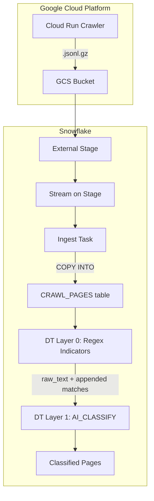

# Plan: Nocturne Snowflake Classification Pipeline (Two-Layer)

## Context

The Nocturne crawler writes dark-web page records as `.jsonl.gz` files to GCS. Each JSON line has `raw_text` plus metadata. We want to classify pages as malware/violation/benign using a two-layer approach:

- **Layer 0 (Regex):** Pattern-match known data security indicators (PII, CCN, crypto wallets, IPs, CVEs, hashes, etc.) and append them as structured annotations to the text
- **Layer 1 (AI\_CLASSIFY):** Classify the enriched text — the AI now sees both the content AND explicitly flagged indicators, improving accuracy

---

## Architecture



---

## Step 1: GCS Storage Integration and External Stage

Create a storage integration for GCS access, then an external stage pointing at the crawl data.

```sql
CREATE OR REPLACE STORAGE INTEGRATION NOCTURNE_GCS_INT
  TYPE = EXTERNAL_STAGE
  STORAGE_PROVIDER = 'GCS'
  ENABLED = TRUE
  STORAGE_ALLOWED_LOCATIONS = ('gcs://nocturne-502617_cloudbuild/source/');

DESC STORAGE INTEGRATION NOCTURNE_GCS_INT;
-- Grant the STORAGE_GCP_SERVICE_ACCOUNT roles/storage.objectViewer in GCP IAM

CREATE DATABASE IF NOT EXISTS NOCTURNE;
CREATE SCHEMA IF NOT EXISTS NOCTURNE.RAW;

CREATE OR REPLACE STAGE NOCTURNE.RAW.GCS_CRAWL_STAGE
  STORAGE_INTEGRATION = NOCTURNE_GCS_INT
  URL = 'gcs://nocturne-502617_cloudbuild/source/'
  DIRECTORY = (ENABLE = TRUE AUTO_REFRESH = TRUE)
  FILE_FORMAT = (TYPE = 'JSON' COMPRESSION = 'GZIP');
```

---

## Step 2: Raw Ingestion Layer (Stream + Task + Table)

```sql
CREATE TABLE IF NOT EXISTS NOCTURNE.RAW.CRAWL_PAGES (
  DOC_ID STRING,
  DEDUPE_KEY STRING,
  RUN_ID STRING,
  SOURCE STRING,
  QUERY STRING,
  URL STRING,
  TITLE STRING,
  FETCH_TIMESTAMP TIMESTAMP_NTZ,
  DEPTH NUMBER,
  MATCHED_KEYWORDS ARRAY,
  LINK_COUNT NUMBER,
  CONTENT_LENGTH NUMBER,
  CONTENT_SHA256 STRING,
  RAW_TEXT STRING,
  SCHEMA_VERSION STRING,
  _SOURCE_FILE STRING,
  _INGESTED_AT TIMESTAMP_NTZ DEFAULT CURRENT_TIMESTAMP()
);

ALTER TABLE NOCTURNE.RAW.CRAWL_PAGES SET CHANGE_TRACKING = TRUE;

CREATE OR REPLACE STREAM NOCTURNE.RAW.CRAWL_STAGE_STREAM
  ON STAGE NOCTURNE.RAW.GCS_CRAWL_STAGE;

CREATE OR REPLACE TASK NOCTURNE.RAW.CRAWL_INGEST_TASK
  WAREHOUSE = <WAREHOUSE>
  SCHEDULE = '5 MINUTE'
  WHEN SYSTEM$STREAM_HAS_DATA('NOCTURNE.RAW.CRAWL_STAGE_STREAM')
AS
  COPY INTO NOCTURNE.RAW.CRAWL_PAGES (
    DOC_ID, DEDUPE_KEY, RUN_ID, SOURCE, QUERY, URL, TITLE,
    FETCH_TIMESTAMP, DEPTH, MATCHED_KEYWORDS, LINK_COUNT,
    CONTENT_LENGTH, CONTENT_SHA256, RAW_TEXT, SCHEMA_VERSION, _SOURCE_FILE
  )
  FROM (
    SELECT
      $1:doc_id::STRING, $1:dedupe_key::STRING, $1:run_id::STRING,
      $1:source::STRING, $1:query::STRING, $1:url::STRING, $1:title::STRING,
      $1:fetch_timestamp::TIMESTAMP_NTZ, $1:depth::NUMBER,
      $1:matched_keywords::ARRAY, $1:link_count::NUMBER,
      $1:content_length::NUMBER, $1:content_sha256::STRING,
      $1:raw_text::STRING, $1:schema_version::STRING, METADATA$FILENAME
    FROM @NOCTURNE.RAW.GCS_CRAWL_STAGE
  )
  FILE_FORMAT = (TYPE = 'JSON' COMPRESSION = 'GZIP')
  PATTERN = '.*\\.jsonl\\.gz'
  ON_ERROR = 'CONTINUE';
```

---

## Step 3: Layer 0 — Regex Indicator Detection (Dynamic Table)

This is the key new layer. A UDF scans `raw_text` with regex patterns for all data security indicators and returns the matches. A dynamic table calls this UDF and appends the findings to the text.

### 3a. Regex Detection UDF

```sql
CREATE OR REPLACE FUNCTION NOCTURNE.RAW.DETECT_INDICATORS(text STRING)
RETURNS STRING
LANGUAGE JAVASCRIPT
AS
$$
  if (!TEXT) return '';

  var patterns = {
    // PII
    'ssn':              /\b\d{3}-\d{2}-\d{4}\b/g,
    'email':            /\b[A-Za-z0-9._%+\-]+@[A-Za-z0-9.\-]+\.[A-Za-z]{2,}\b/g,
    'phone':            /\b(?:\+?1[-.\s]?)?\(?\d{3}\)?[-.\s]?\d{3}[-.\s]?\d{4}\b/g,
    'drivers_license':  /\b[A-Z]\d{7,12}\b/g,

    // Financial
    'credit_card':      /\b(?:4\d{3}|5[1-5]\d{2}|3[47]\d{2}|6(?:011|5\d{2}))[- ]?\d{4}[- ]?\d{4}[- ]?\d{4}\b/g,
    'bitcoin_wallet':   /\b(?:1|3|bc1)[A-Za-z0-9]{25,42}\b/g,
    'ethereum_wallet':  /\b0x[a-fA-F0-9]{40}\b/g,
    'monero_wallet':    /\b4[0-9AB][1-9A-HJ-NP-Za-km-z]{93}\b/g,

    // Network / IOC
    'ipv4':             /\b(?:(?:25[0-5]|2[0-4]\d|[01]?\d\d?)\.){3}(?:25[0-5]|2[0-4]\d|[01]?\d\d?)\b/g,
    'ipv6':             /\b(?:[0-9a-fA-F]{1,4}:){7}[0-9a-fA-F]{1,4}\b/g,
    'onion_url':        /\b[a-z2-7]{16,56}\.onion\b/g,
    'domain':           /\b(?:[a-z0-9](?:[a-z0-9\-]{0,61}[a-z0-9])?\.)+(?:com|net|org|io|xyz|ru|cc|to)\b/gi,

    // Vulnerability / Malware
    'cve':              /\bCVE-\d{4}-\d{4,}\b/gi,
    'md5_hash':         /\b[a-fA-F0-9]{32}\b/g,
    'sha1_hash':        /\b[a-fA-F0-9]{40}\b/g,
    'sha256_hash':      /\b[a-fA-F0-9]{64}\b/g,

    // Credentials / Secrets
    'api_key':          /\b(?:api[_-]?key|apikey|token)[=: ]+['\"]?[A-Za-z0-9\-_]{20,}['\"]?\b/gi,
    'password_leak':    /\b(?:password|passwd|pwd)[=: ]+[^\s]{4,}\b/gi
  };

  var results = [];
  for (var name in patterns) {
    var matches = TEXT.match(patterns[name]);
    if (matches) {
      // Deduplicate and limit to 10 per type to control text length
      var unique = matches.filter(function(v, i, a) { return a.indexOf(v) === i; }).slice(0, 10);
      for (var i = 0; i < unique.length; i++) {
        results.push(name + ' = ' + unique[i]);
      }
    }
  }
  return results.length > 0 ? results.join('\n') : '';
$$;
```

### 3b. Layer 0 Dynamic Table

```sql
CREATE OR REPLACE DYNAMIC TABLE NOCTURNE.RAW.DT_REGEX_INDICATORS
  WAREHOUSE = <WAREHOUSE>
  TARGET_LAG = 'DOWNSTREAM'
  REFRESH_MODE = INCREMENTAL
  INITIALIZE = ON_CREATE
AS
  SELECT
    DOC_ID,
    DEDUPE_KEY,
    URL,
    TITLE,
    RAW_TEXT,
    FETCH_TIMESTAMP,
    MATCHED_KEYWORDS,
    _SOURCE_FILE,
    _INGESTED_AT,
    NOCTURNE.RAW.DETECT_INDICATORS(RAW_TEXT) AS INDICATORS_FOUND,
    CASE WHEN NOCTURNE.RAW.DETECT_INDICATORS(RAW_TEXT) != ''
      THEN RAW_TEXT || '\n\n--- DETECTED INDICATORS ---\n' || NOCTURNE.RAW.DETECT_INDICATORS(RAW_TEXT)
      ELSE RAW_TEXT
    END AS ENRICHED_TEXT
  FROM NOCTURNE.RAW.CRAWL_PAGES;
```

**What this does:** For each page, if regex matches are found, the `ENRICHED_TEXT` column contains the original text with a section appended like:

```
[original raw_text content...]

--- DETECTED INDICATORS ---
bitcoin_wallet = 1A1zP1eP5QGefi2DMPTfTL5SLmv7DivfNa
ipv4 = 192.168.1.1
credit_card = 4532-1234-5678-9012
cve = CVE-2024-12345
email = seller@darkmarket.onion
```

---

## Step 4: Layer 1 — AI Classification (Dynamic Table)

```sql
CREATE OR REPLACE DYNAMIC TABLE NOCTURNE.RAW.DT_PAGE_CLASSIFICATION
  WAREHOUSE = <WAREHOUSE>
  TARGET_LAG = '30 MINUTE'
  REFRESH_MODE = INCREMENTAL
  INITIALIZE = ON_CREATE
AS
  SELECT
    DOC_ID,
    DEDUPE_KEY,
    URL,
    TITLE,
    RAW_TEXT,
    INDICATORS_FOUND,
    FETCH_TIMESTAMP,
    AI_CLASSIFY(
      ENRICHED_TEXT,
      ['malware', 'violation', 'benign'],
      {
        'task_description': 'Classify dark web page content. malware = pages offering malware, exploit kits, RATs, ransomware, hacking tools or services. violation = pages with illegal marketplaces, stolen PII/credentials, credit card dumps, drug sales, or financial fraud. benign = forums, informational pages, news, mirrors of legitimate services. The DETECTED INDICATORS section at the end lists regex-matched data patterns found — use these as strong signals (e.g., credit cards and leaked passwords strongly suggest violation; CVEs and hashes suggest malware).'
      }
    ):labels[0]::VARCHAR AS CATEGORY,
    AI_CLASSIFY(
      ENRICHED_TEXT,
      ['malware', 'violation', 'benign'],
      {
        'task_description': 'Classify dark web page content. malware = pages offering malware, exploit kits, RATs, ransomware, hacking tools or services. violation = pages with illegal marketplaces, stolen PII/credentials, credit card dumps, drug sales, or financial fraud. benign = forums, informational pages, news, mirrors of legitimate services. The DETECTED INDICATORS section at the end lists regex-matched data patterns found — use these as strong signals (e.g., credit cards and leaked passwords strongly suggest violation; CVEs and hashes suggest malware).'
      }
    ) AS CLASSIFICATION_RESULT,
    _INGESTED_AT
  FROM NOCTURNE.RAW.DT_REGEX_INDICATORS;
```

The AI now sees text like:

> "Welcome to our marketplace... \[page content] ... --- DETECTED INDICATORS --- credit\_card = 4532-1234-5678-9012, bitcoin\_wallet = 1A1z..."

This gives it concrete evidence, not just vibes from the text.

---

## Step 5: Seed, Verify, Go Live

1. Seed existing GCS files into CRAWL\_PAGES via initial COPY INTO
2. Force-refresh both dynamic tables and confirm INCREMENTAL mode
3. Validate classification distribution: `SELECT CATEGORY, COUNT(*) FROM DT_PAGE_CLASSIFICATION GROUP BY CATEGORY`
4. Resume the ingest task for ongoing processing

---

## Cost and Performance Notes

- **Layer 0 (regex UDF)**: Near-zero cost — pure compute, no AI credits
- **Layer 1 (AI\_CLASSIFY)**: Billed per input token. The appended indicators add minimal tokens but significantly improve classification signal
- **Optimization**: The UDF is called multiple times in the DT definition above — in implementation we'll use a single call and reference the result column (or use a CTE-like pattern within the DT)
- Check current rates: [AI Functions Costs](<> "https://docs.snowflake.com/en/user-guide/snowflake-cortex/aisql-cost")

---

## Prerequisites

1. ACCOUNTADMIN role for storage integration
2. GCP IAM: Grant Snowflake's service account `roles/storage.objectViewer`
3. Active warehouse name
4. `SNOWFLAKE.CORTEX_USER` database role granted to the executing role
