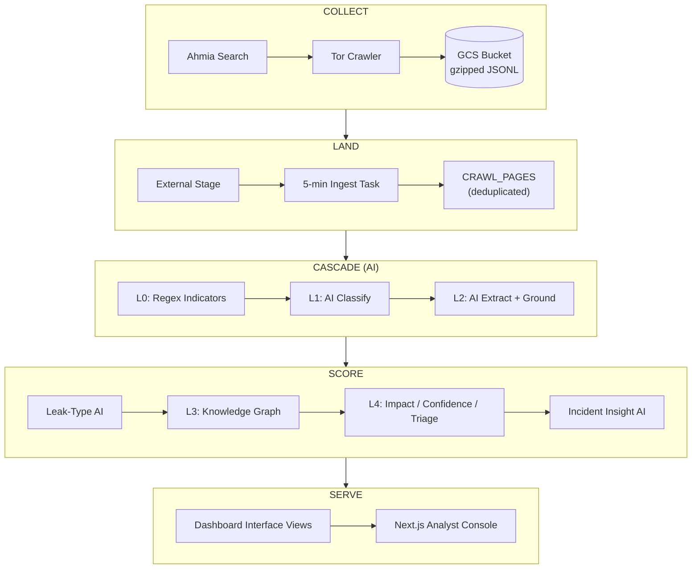

<p align="center">
  
</p>

<h3 align="center">Dark-web breach intelligence, from crawl to analyst dashboard</h3>

<p align="center">
  Bounded Tor crawler &rarr; GCS landing &rarr; Snowflake AI pipeline &rarr; Next.js analyst console
</p>

---

Nocturne is a bounded dark-web crawler that discovers onion URLs through Ahmia,
fetches matching pages through Tor, and writes raw page records to
gzip-compressed JSONL batches in Google Cloud Storage. A multi-stage Snowflake
pipeline then classifies, extracts, grounds, and scores each page into
actionable breach incidents — surfaced through a real-time analyst dashboard.

---

## Table of Contents

- [Architecture](#architecture)
- [Repository Layout](#repository-layout)
- [Deploy to Google Cloud](#deploy-to-google-cloud)
- [Deploy the Snowflake Pipeline](#deploy-the-snowflake-pipeline)
- [Analyst Dashboard](#analyst-dashboard)

---

## Architecture



| Stage | What happens |
| :---: | :--- |
| **Collect** | Crawler discovers .onion URLs via Ahmia, fetches pages through Tor, writes gzipped JSONL to GCS |
| **Land** | Snowflake ingests from GCS every 5 min, deduplicates by `(org_id, dedupe_key)` |
| **Cascade** | Deterministic regex indicators (L0), AI relationship classification (L1), AI extraction + grounding (L2) |
| **Score** | Leak-type classification, knowledge graph (L3), impact/confidence/triage scoring (L4), incident insights |
| **Serve** | Dashboard interface views consumed by the Next.js analyst console |


---

## Repository Layout

<table>
<tr><td colspan="2"><strong>Crawler</strong></td></tr>
<tr><td><code>src/nocturne_crawler/scraper.py</code></td><td>BFS dark-web crawler with Tor SOCKS + headless Chromium</td></tr>
<tr><td><code>src/nocturne_crawler/storage.py</code></td><td>Local file and GCS output backends</td></tr>
<tr><td><code>config.yaml</code></td><td>Organization slug, query, keywords, depth/page limits</td></tr>
<tr><td><code>Dockerfile</code></td><td>Tor + Chromium container image</td></tr>
<tr><td><code>requirements.txt</code></td><td>Crawler Python dependencies</td></tr>

<tr><td colspan="2"><strong>Snowflake Pipeline</strong></td></tr>
<tr><td><code>snowflake/01-16_*.sql</code></td><td>16 ordered pipeline steps (ingestion through dashboard views)</td></tr>
<tr><td><code>snowflake/99_cleanup.sql</code></td><td>Destructive teardown (never auto-deployed)</td></tr>
<tr><td><code>snowflake/tests/</code></td><td>SQL unit tests for UDFs and routing logic</td></tr>
<tr><td><code>deploy_pipeline.py</code></td><td>Deploys, validates, and reports on the full pipeline</td></tr>
<tr><td><code>cleanup_snowflake.py</code></td><td>Interactive destructive cleanup wrapper</td></tr>

<tr><td colspan="2"><strong>Analyst Dashboard</strong></td></tr>
<tr><td><code>nocturne_dashboard/</code></td><td>Next.js 15 + MUI v6 analyst console (<a href="nocturne_dashboard/README.md">its own README</a>)</td></tr>

<tr><td colspan="2"><strong>Infrastructure & CI</strong></td></tr>
<tr><td><code>.github/workflows/</code></td><td>CI/CD pipeline definitions</td></tr>
<tr><td><code>.env.example</code></td><td>Snowflake credential template (copy to <code>.env</code>)</td></tr>
<tr><td><code>scripts/</code></td><td>Diagram renderer, multi-org crawl config helper</td></tr>

<tr><td colspan="2"><strong>Documentation & Tests</strong></td></tr>
<tr><td><code>architecture.md</code></td><td>Full architecture deep-dive with mermaid diagrams</td></tr>
<tr><td><code>plans/</code></td><td>Design documents (severity model, L2-L4 design)</td></tr>
<tr><td><code>examples/</code></td><td>Sample crawler output and multi-org test fixtures</td></tr>
<tr><td><code>tests/</code></td><td>Python unit tests</td></tr>
<tr><td><code>logs/</code></td><td>Generated timestamped pipeline/cleanup logs (gitignored)</td></tr>
</table>

---

## Deploy to Google Cloud

The following commands create a private raw bucket, a write-only crawler identity,
an Artifact Registry repository, a container image, and a Cloud Run Job.

<details>
<summary><strong>Step 1: Set deployment values</strong></summary>

```bash
export NOCTURNE_PROJECT_ID="your-gcp-project-id"
export NOCTURNE_REGION="us-central1"
export NOCTURNE_BUCKET="${NOCTURNE_PROJECT_ID}-nocturne-raw"
export NOCTURNE_REPOSITORY="nocturne-containers"
export NOCTURNE_IMAGE="crawler"
export NOCTURNE_IMAGE_TAG="v1"
export NOCTURNE_JOB="nocturne-crawler"
export NOCTURNE_SERVICE_ACCOUNT="crawler-uploader"
export NOCTURNE_SERVICE_EMAIL="${NOCTURNE_SERVICE_ACCOUNT}@${NOCTURNE_PROJECT_ID}.iam.gserviceaccount.com"
export NOCTURNE_IMAGE_URI="${NOCTURNE_REGION}-docker.pkg.dev/${NOCTURNE_PROJECT_ID}/${NOCTURNE_REPOSITORY}/${NOCTURNE_IMAGE}:${NOCTURNE_IMAGE_TAG}"

gcloud config set project "$NOCTURNE_PROJECT_ID"
```

Bucket names are globally unique. Change `NOCTURNE_BUCKET` if that name is already
owned by another project.

</details>

<details>
<summary><strong>Step 2: Enable APIs</strong></summary>

```bash
gcloud services enable \
  artifactregistry.googleapis.com \
  cloudbuild.googleapis.com \
  cloudscheduler.googleapis.com \
  iam.googleapis.com \
  run.googleapis.com \
  storage.googleapis.com
```

</details>

<details>
<summary><strong>Step 3: Create and secure the raw bucket</strong></summary>

```bash
gcloud storage buckets create "gs://${NOCTURNE_BUCKET}" \
  --location="$NOCTURNE_REGION" \
  --default-storage-class=STANDARD \
  --uniform-bucket-level-access \
  --public-access-prevention
```

</details>

<details>
<summary><strong>Step 4: Create the crawler identity</strong></summary>

```bash
gcloud iam service-accounts create "$NOCTURNE_SERVICE_ACCOUNT" \
  --display-name="Nocturne crawler GCS uploader"

gcloud storage buckets add-iam-policy-binding "gs://${NOCTURNE_BUCKET}" \
  --member="serviceAccount:${NOCTURNE_SERVICE_EMAIL}" \
  --role="roles/storage.objectCreator"
```

`roles/storage.objectCreator` lets the job create new objects but does not let it
read, list, overwrite, or delete existing raw objects.

</details>

<details>
<summary><strong>Step 5: Build the image</strong></summary>

```bash
gcloud artifacts repositories create "$NOCTURNE_REPOSITORY" \
  --repository-format=docker \
  --location="$NOCTURNE_REGION" \
  --description="Nocturne crawler images"

gcloud builds submit . \
  --region="$NOCTURNE_REGION" \
  --tag="$NOCTURNE_IMAGE_URI"
```

</details>

<details>
<summary><strong>Step 6: Deploy the Cloud Run Job</strong></summary>

```bash
gcloud run jobs deploy "$NOCTURNE_JOB" \
  --image="$NOCTURNE_IMAGE_URI" \
  --region="$NOCTURNE_REGION" \
  --service-account="$NOCTURNE_SERVICE_EMAIL" \
  --tasks=1 \
  --parallelism=1 \
  --cpu=2 \
  --memory=2Gi \
  --task-timeout=2h \
  --max-retries=1 \
  --set-env-vars="OUTPUT_BACKEND=gcs,GCS_BUCKET=${NOCTURNE_BUCKET},GCS_PREFIX=raw/crawls"
```

</details>

<details>
<summary><strong>Step 7: Execute and verify</strong></summary>

```bash
gcloud run jobs execute "$NOCTURNE_JOB" \
  --region="$NOCTURNE_REGION" \
  --wait

gcloud storage ls --recursive "gs://${NOCTURNE_BUCKET}/raw/crawls/**"
```

</details>

---

## Deploy the Snowflake Pipeline

The Snowflake pipeline keeps deterministic transformations in dynamic tables and
stores every paid AI result in a persistent table. It maintains the crawler's
organization boundary from ingestion through the final dashboard output.

```text
GCS JSONL.gz -> CRAWL_PAGES
  -> L0 deterministic indicators and evidence windows
  -> L1 cached relationship AI
  -> L2 cached unbiased extraction, grounding, and target resolution
  -> cached leak-type AI for target-confirmed leaks only
  -> L3 target knowledge graph
  -> L4 impact/confidence/triage scores
  -> cached per-incident AI insight
  -> dashboard interface views
```

### What each Snowflake file adds

| Step | File | Purpose |
| --- | --- | --- |
| 01 | `01_storage_integration.sql` | Creates the Snowflake GCS storage integration |
| 02 | `02_ingestion_layer.sql` | Creates the gzip JSON format, stage, raw table, and five-minute ingestion task |
| 03 | `03_target_configuration.sql` | Creates the monitored-organization configuration table |
| 04 | `04_detect_indicators_udf.sql` | Deterministic JavaScript indicator detector (cards, credentials, tokens, keys, hashes, CVEs, emails, domains) |
| 05 | `05_dt_regex_indicators.sql` | Rejects invalid organization scope, runs the detector once per page |
| 06 | `06_build_classification_input_udf.sql` | Builds target-aware L1 input and evidence-only L2 input from ranked windows |
| 07 | `07_dt_l1_classification_input.sql` | Deduplicates by `(ORG_ID, DEDUPE_KEY)`, joins only the matching enabled organization |
| 08 | `08_dt_relationship_classification.sql` | Persistent relationship cache, incremental candidates, stream, and triggered `AI_CLASSIFY` task |
| 09 | `09_dt_l2_extraction_ai.sql` | Sends only L1 target leaks and suspicious mentions to a cached `AI_COMPLETE` extraction task |
| 10 | `10_dt_l2_grounding_routing.sql` | Validates extraction, grounds evidence, resolves target names/domains, routes each page |
| 11 | `11_dt_leak_type_severity.sql` | Runs cached multi-label leak-type AI only after L2 returns `target_confirmed` |
| 12 | `12_dt_l3_knowledge_graph.sql` | Promotes accepted, grounded, target-connected claims into an organization-scoped knowledge graph |
| 13 | `13_dt_l4_severity.sql` | Separates impact, confidence, and triage priority; exposes document/incident/org views |
| 14 | `14_ai_incident_insights.sql` | Persistent triggered `AI_COMPLETE` cache producing one dashboard narrative per incident |
| 15 | `15_seed_validate_golive.sql` | Validates organization isolation, resumes all tasks |
| 16 | `16_dashboard_interface.sql` | Creates stable dashboard views (incidents, org summaries, monitor, claims, graph) |

### AI gating, caching, and task behavior

The four paid AI stages (relationship classification, L2 extraction, leak-type
classification, incident insights) each use:

```text
incremental candidate dynamic table
  -> standard stream
  -> stream-triggered task
  -> persistent result table
```

AI tasks have no polling schedule. They run only when their candidate stream has
data, and a waiting triggered task does not keep its warehouse active.

### Organization gating

1. L1 classifies each valid, deduplicated page for its intended organization.
2. L2 receives `target_data_leak`, plus `target_mentioned_no_leak` only when a
   deterministic target anchor and leak/indicator signal make it suspicious.
3. L2 extracts from `EVIDENCE_INPUT` without seeing configured target metadata;
   deterministic SQL then grounds evidence and resolves entities.
4. `target_confirmed` requires a grounded leak claim connected by an accepted
   `ALLEGEDLY_AFFECTS` edge to the resolved target organization or exact domain.
5. If no organization/domain resolves to the monitored target, the page does not
   reach leak-type AI, L3, target severity, or incident insights.

Only `target_confirmed` pages are target-alert eligible.

### L4 scores

L4 produces three independent 0-100 metrics:

```text
impact      = 0.60 * data_sensitivity + 0.25 * exposure_actionability + 0.15 * claimed_scale
confidence  = 0.35 * ownership_evidence + 0.25 * evidence_grounding + 0.20 * claim_proof
              + 0.15 * distinct_content_corroboration + 0.05 * actor_credibility
triage      = 0.80 * impact + 0.20 * confidence
```

Bands: informational (0-19), low (20-39), medium (40-59), high (60-79), critical (80-100).

### Snowflake prerequisites

- A warehouse named `COMPUTE_WH`
- A role with permission to create database, schemas, integration, stage, task, functions, and dynamic tables
- Cortex access and `claude-sonnet-4-5` model availability
- At least one GCS `part-*.jsonl.gz` object for an end-to-end result

### Multi-organization support

The pipeline supports multiple organizations. Each organization gets its own
crawler execution and a matching configuration row in
`NOCTURNE.CONFIG.MONITORED_ORGANIZATIONS`. All organizations share the same GCS
bucket and Snowflake tables — paths, hashes, cache keys, graph keys, and final
views are all scoped by `ORG_ID`.

---

## Analyst Dashboard

The **Nocturne Console** is a Next.js 15 (App Router) + MUI v6 analyst front end
that reads from the dashboard interface views created in step 16.

```bash
cd nocturne_dashboard
npm install
npm run dev          # http://localhost:3000
```

