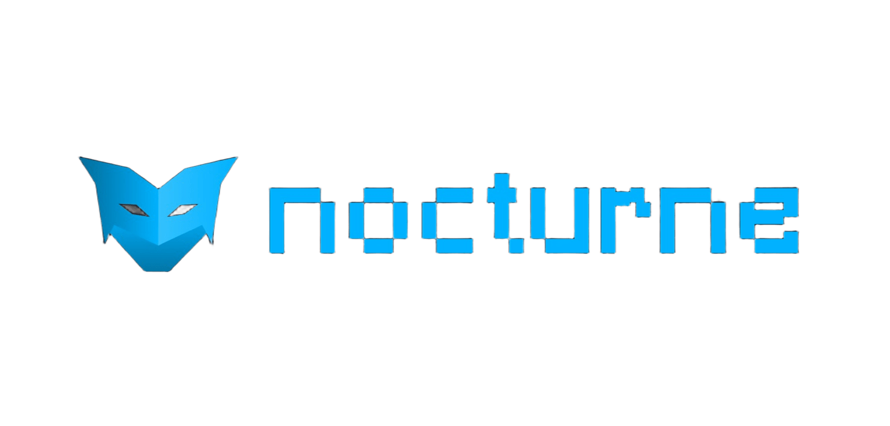
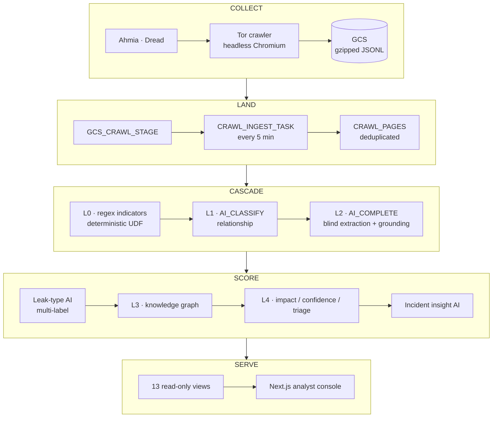
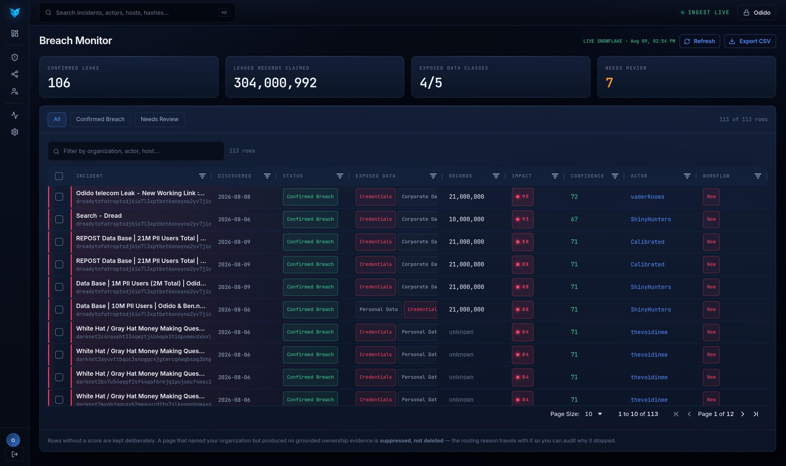
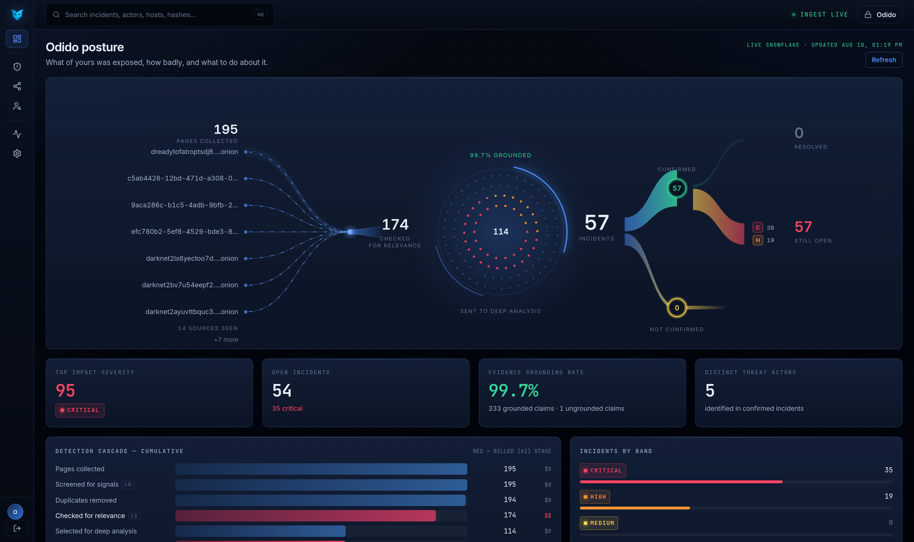

<p align="center">
  
</p>

<p align="center">
  
</p>

<p align="center">
  <strong>Dark-web breach intelligence with the receipt attached.</strong><br />
  Nocturne finds the leaks that are actually yours, and shows you the exact line that proves it.
</p>

<p align="center">
  
  
  
  
  
  
  
  
  
</p>

<p align="center">
  <a href="https://nocturne-console.web.app"><strong>Open the console</strong></a> |
  <a href="#the-product"><strong>The product</strong></a> |
  <a href="#how-nocturne-works">Workflow</a> |
  <a href="#system-at-a-glance">Architecture</a> |
  <a href="#the-knowledge-graph">Knowledge graph</a> |
  <a href="#severity-in-three-parts">Scoring</a> |
  <a href="#deploy">Deploy</a>
</p>

---

## The product

Dark-web monitoring products are good at finding pages and bad at answering the only
question that matters: **is this actually us?** They match a keyword, fire an alert,
and leave the verification to an analyst — who then spends an afternoon establishing
that a "breach" was somebody else's, or a resale of a five-year-old dump, or nothing
at all.

**Nocturne inverts the burden of proof.**

It crawls the same sources, extracts claims from the page *without ever showing the
model which organization you are monitoring*, and then uses deterministic SQL to
resolve what it found against your configured names and domains. A page becomes a
confirmed incident only when a grounded leak claim connects to you through an
accepted `ALLEGEDLY_AFFECTS` edge. If nothing resolves to you, it never reaches leak
typing, the graph, or your inbox.

What you get is not a feed. It is an incident with its evidence attached: the
verbatim span, the offsets into the source page, the actor, the marketplace, and
three independent scores.

### The operating principle

| Conventional dark-web monitoring         | Nocturne                                                              |
| ---------------------------------------- | --------------------------------------------------------------------- |
| Alerts on a keyword match                | Requires a grounded claim edge that resolves to your organization     |
| Shows the model your name, then agrees   | Extracts blind; deterministic SQL resolves identity afterwards        |
| Summarizes the page                      | Carries the verbatim span and its offsets into the source             |
| One severity number                      | Impact, confidence, and triage priority scored independently          |
| Spends AI budget on everything collected | Deterministic regex runs on all; cached AI runs only on what survives |
| "Trust our analysts"                     | Every claim traceable to the line it came from                        |
| Re-alerts on every recrawl               | Deduplicated by `(org_id, dedupe_key)`; AI cached against its input  |

---

## How Nocturne works

A cascade, in which every stage is allowed to throw work away and the expensive
stages sit last on purpose. Figures below are live from one monitored tenant.

| Stage        | What happens                                                                    |      Survived |
| :----------- | :------------------------------------------------------------------------------ | ------------: |
| **L0** | Tor pages landed and swept for indicators by a deterministic UDF — no AI spend | **195** |
| **L0** | Duplicates removed on `(org_id, dedupe_key)`                                   | **194** |
| **L1** | Cached `AI_CLASSIFY` keeps only plausible target leaks                         | **174** |
| **L2** | Cached `AI_COMPLETE` extraction — evidence only, target hidden                | **114** |
| **L4** | Grounded, graphed, and scored for impact / confidence / triage                  |  **57** |

99.7% of claims ground back to a verbatim span in their source page — 333 grounded
against 1 ungrounded.

1. **Collect.** A breadth-first crawler discovers `.onion` URLs via Ahmia and Dread,
   fetches them through Tor with headless Chromium, and writes gzipped JSONL to GCS.
2. **Land.** Snowflake ingests every five minutes and deduplicates on
   `(org_id, dedupe_key)`, so a page recrawled tomorrow costs nothing twice.
3. **Screen.** A JavaScript UDF detects cards, credentials, tokens, keys, hashes,
   CVEs, emails and domains — deterministically, with no AI spend.
4. **Classify.** `AI_CLASSIFY` decides each page's relationship to the target. Only
   target leaks and genuinely suspicious mentions go further.
5. **Extract and ground.** `AI_COMPLETE` reads an evidence window that contains no
   target metadata. SQL then validates the extraction, grounds each quote, and
   resolves entities against your configured profile.
6. **Score and explain.** Leak typing, the L3 graph, three-axis L4 severity, and one
   cached AI narrative per incident.

> **AI stages have no polling schedule.** Each is a dynamic table feeding a stream
> feeding a triggered task feeding a persistent result table. They run only when
> there is new material, and a waiting task holds no warehouse.

---

## System at a glance



**One boundary, held end to end.** Paths, hashes, cache keys, graph keys and every
serving view are scoped by `ORG_ID`. Multi-tenancy is a property of the schema, not
a filter applied at the end.

---

## The knowledge graph

<p align="center">
  
</p>

Extracted entities become nodes; resolved relationships become edges. Six edge types
exist, and exactly one of them decides whether a leak is yours.

| Edge                  | Meaning                                         |
| :-------------------- | :---------------------------------------------- |
| `MADE_CLAIM`        | Actor posted or advertised the leak             |
| `ALLEGEDLY_AFFECTS` | **Claim targets a specific organization** |
| `MENTIONS`          | Claim references a data asset                   |
| `LISTED_ON`         | Claim appeared on a marketplace or forum        |
| `HAS_DOMAIN`        | Organization owns a domain seen in evidence     |
| `OPERATES_ON`       | Actor has presence on a marketplace             |

A claim is promoted into the graph only when it is **accepted**, **grounded**, and
connected to a monitored target. Everything else stays in the audit trail where an
analyst can find it, and out of the alert path.

---

## Severity in three parts

How bad it would be, how sure we are, and what to open first are three different
questions — so they are three independent 0–100 scores.

```text
impact      = 0.60·data_sensitivity + 0.25·exposure_actionability + 0.15·claimed_scale

confidence  = 0.35·ownership_evidence + 0.25·evidence_grounding + 0.20·claim_proof
            + 0.15·distinct_content_corroboration + 0.05·actor_credibility

triage      = 0.80·impact + 0.20·confidence
```

Banded `informational` 0–19 · `low` 20–39 · `medium` 40–59 · `high` 60–79 ·
`critical` 80–100. A terrifying claim with thin evidence sorts differently from a
modest one that is nailed down.

---

## Repository layout

| Path                       | What it is                                                                 |
| :------------------------- | :------------------------------------------------------------------------- |
| `src/nocturne_crawler/`  | BFS dark-web crawler — Tor SOCKS, headless Chromium, GCS output           |
| `config.yaml`            | Organization slug, query, keywords, depth and page limits                  |
| `snowflake/01–16_*.sql` | The pipeline, in dependency order — ingestion through view layer          |
| `snowflake/tests/`       | SQL unit tests for the UDFs and routing logic                              |
| `deploy_pipeline.py`     | Deploys, validates, and reports on the full pipeline                       |
| `nocturne_dashboard/`    | Next.js 15 analyst console ([its own README](nocturne_dashboard/README.md)) |
| `plans/`                 | Design documents — severity model, L2–L4 design                          |
| `examples/`              | Sample crawler output and multi-org test fixtures                          |
| `.github/workflows/`     | Pipeline deploy on push to `snowflake/**`                                 |

<details>
<summary><strong>What each Snowflake step adds</strong></summary>

<br />

| Step | File                                      | Purpose                                                                     |
| ---- | ----------------------------------------- | --------------------------------------------------------------------------- |
| 01   | `01_storage_integration.sql`            | GCS storage integration                                                     |
| 02   | `02_ingestion_layer.sql`                | Gzip JSON format, stage, raw table, five-minute ingestion task              |
| 03   | `03_target_configuration.sql`           | Monitored-organization configuration table                                  |
| 04   | `04_detect_indicators_udf.sql`          | Deterministic indicator detector — cards, credentials, tokens, keys, CVEs  |
| 05   | `05_dt_regex_indicators.sql`            | Rejects invalid organization scope, runs the detector once per page         |
| 06   | `06_build_classification_input_udf.sql` | Target-aware L1 input and evidence-only L2 input from ranked windows        |
| 07   | `07_dt_l1_classification_input.sql`     | Deduplicates by `(ORG_ID, DEDUPE_KEY)`, joins the matching enabled org     |
| 08   | `08_dt_relationship_classification.sql` | Relationship cache, incremental candidates, stream, triggered task          |
| 09   | `09_dt_l2_extraction_ai.sql`            | Cached `AI_COMPLETE` extraction on L1 survivors only                       |
| 10   | `10_dt_l2_grounding_routing.sql`        | Validates extraction, grounds evidence, resolves entities, routes each page |
| 11   | `11_dt_leak_type_severity.sql`          | Cached multi-label leak-type AI, gated on `target_confirmed`               |
| 12   | `12_dt_l3_knowledge_graph.sql`          | Promotes accepted, grounded, target-connected claims into the graph         |
| 13   | `13_dt_l4_severity.sql`                 | Impact, confidence, triage; document / incident / org views                 |
| 14   | `14_ai_incident_insights.sql`           | Triggered `AI_COMPLETE` cache — one narrative per incident                |
| 15   | `15_seed_validate_golive.sql`           | Validates organization isolation, resumes all tasks                         |
| 16   | `16_dashboard_interface.sql`            | The 13 stable read-only views the console consumes                          |

</details>

---

## Deploy

### Prerequisites

- A Snowflake account with Cortex access and `claude-sonnet-4-5` available
- A warehouse named `COMPUTE_WH`, and a role that can create databases, schemas,
  integrations, stages, tasks, functions and dynamic tables
- A Google Cloud project, for the crawler job and the console

<details>
<summary><strong>1 · The crawler on Google Cloud</strong></summary>

<br />

Creates a private raw bucket, a write-only crawler identity, an Artifact Registry
repository, a container image, and a Cloud Run Job.

```bash
export NOCTURNE_PROJECT_ID="your-gcp-project-id"
export NOCTURNE_REGION="us-central1"
export NOCTURNE_BUCKET="${NOCTURNE_PROJECT_ID}-nocturne-raw"
export NOCTURNE_REPOSITORY="nocturne-containers"
export NOCTURNE_JOB="nocturne-crawler"
export NOCTURNE_SERVICE_ACCOUNT="crawler-uploader"
export NOCTURNE_SERVICE_EMAIL="${NOCTURNE_SERVICE_ACCOUNT}@${NOCTURNE_PROJECT_ID}.iam.gserviceaccount.com"
export NOCTURNE_IMAGE_URI="${NOCTURNE_REGION}-docker.pkg.dev/${NOCTURNE_PROJECT_ID}/${NOCTURNE_REPOSITORY}/crawler:v1"

gcloud config set project "$NOCTURNE_PROJECT_ID"

gcloud services enable \
  artifactregistry.googleapis.com cloudbuild.googleapis.com \
  cloudscheduler.googleapis.com iam.googleapis.com \
  run.googleapis.com storage.googleapis.com

gcloud storage buckets create "gs://${NOCTURNE_BUCKET}" \
  --location="$NOCTURNE_REGION" --default-storage-class=STANDARD \
  --uniform-bucket-level-access --public-access-prevention

gcloud iam service-accounts create "$NOCTURNE_SERVICE_ACCOUNT" \
  --display-name="Nocturne crawler GCS uploader"

gcloud storage buckets add-iam-policy-binding "gs://${NOCTURNE_BUCKET}" \
  --member="serviceAccount:${NOCTURNE_SERVICE_EMAIL}" \
  --role="roles/storage.objectCreator"
```

`roles/storage.objectCreator` lets the job create new objects but not read, list,
overwrite, or delete existing ones.

```bash
gcloud artifacts repositories create "$NOCTURNE_REPOSITORY" \
  --repository-format=docker --location="$NOCTURNE_REGION"

gcloud builds submit . --region="$NOCTURNE_REGION" --tag="$NOCTURNE_IMAGE_URI"

gcloud run jobs deploy "$NOCTURNE_JOB" \
  --image="$NOCTURNE_IMAGE_URI" --region="$NOCTURNE_REGION" \
  --service-account="$NOCTURNE_SERVICE_EMAIL" \
  --tasks=1 --parallelism=1 --cpu=2 --memory=2Gi \
  --task-timeout=2h --max-retries=1 \
  --set-env-vars="OUTPUT_BACKEND=gcs,GCS_BUCKET=${NOCTURNE_BUCKET},GCS_PREFIX=raw/crawls"

gcloud run jobs execute "$NOCTURNE_JOB" --region="$NOCTURNE_REGION" --wait
gcloud storage ls --recursive "gs://${NOCTURNE_BUCKET}/raw/crawls/**"
```

Bucket names are globally unique — change `NOCTURNE_BUCKET` if that one is taken.

</details>

<details>
<summary><strong>2 · The Snowflake pipeline</strong></summary>

<br />

```bash
cp .env.example .env          # fill in the Snowflake values
pip install -r snowflake/requirements.txt
python deploy_pipeline.py     # deploys, validates, and reports
```

`deploy_pipeline.py` runs the 16 steps in order and verifies organization isolation
before resuming tasks. Pass a step number to run one in isolation. Teardown lives in
`cleanup_snowflake.py`, which is interactive and never runs automatically.

</details>

<details>
<summary><strong>3 · The analyst console</strong></summary>

<br />

```bash
cd nocturne_dashboard
cp .env.example .env.local    # Snowflake credentials + session secret
npm install
npm run dev
```

To ship it to Cloud Run behind Firebase Hosting:

```bash
MIN_INSTANCES=0 ./deploy.sh
```

One command — it checks your tools, signs you in, uploads secrets, builds the image
remotely, puts the Hosting hostname in front, and verifies the result. `MIN_INSTANCES=0`
scales to zero when idle; set it to `1` for a demo, at the cost of a warm instance.

</details>

---

## The analyst console

Next.js 15 (App Router) · React 19 · MUI v6 · TypeScript, reading the thirteen views
from step 16. Public landing page at `/start`; everything else is behind a signed,
HttpOnly session cookie with tenant scope enforced server-side on every route.

<p align="center">
  
  <em>Breach Monitor — every row the cascade produced, scored and filterable.</em>
</p>

<p align="center">
  
  <em>Command Center — what changed, and what to open first.</em>
</p>

| Surface                   | What it answers                                                        |
| :------------------------ | :--------------------------------------------------------------------- |
| **Command Center**  | What changed, and what should I open first                             |
| **Breach Monitor**  | Every row the cascade produced, filterable by status                   |
| **Incident Detail** | The verbatim evidence, its offsets, the score vector, the AI narrative |
| **Knowledge Graph** | The entities and edges behind an incident, interactively               |
| **Threat Actors**   | Who is claiming what, and how credible they have been                  |
| **Pipeline**        | Cascade health, rejection reasons, AI cache hit rates, version drift   |

<p align="center">
  <a href="https://nocturne-console.web.app"><strong>→ Open the console</strong></a>
</p>
