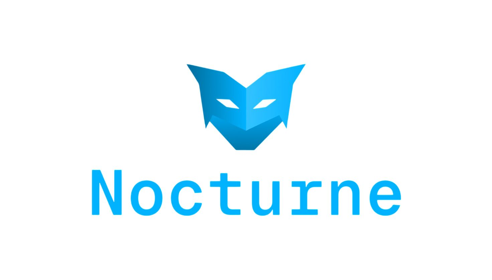
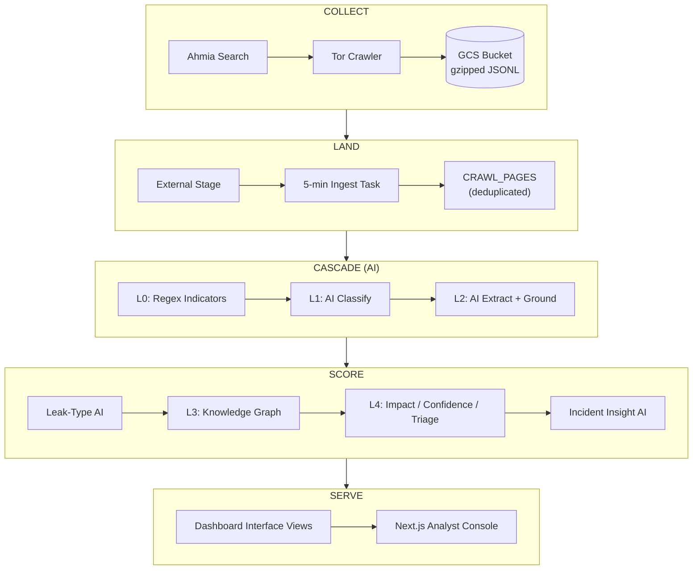

<p align="center">
  
</p>

<h3 align="center">Dark-web breach intelligence, from crawl to analyst dashboard</h3>

<p align="center">
  Bounded Tor crawler &rarr; GCS landing &rarr; Snowflake AI pipeline &rarr; Next.js analyst console
</p>

---

Nocturne is a bounded dark-web crawler that discovers onion URLs through Ahmia,
fetches matching pages through Tor, and writes raw page records to
gzip-compressed JSONL batches in Google Cloud Storage. A multi-stage Snowflake
pipeline then classifies, extracts, grounds, and scores each page into
actionable breach incidents — surfaced through a real-time analyst dashboard.

---

## Table of Contents

- [Quickstart](#quickstart)
- [Architecture](#architecture)
- [Repository Layout](#repository-layout)
- [How Storage Works](#how-storage-works)
- [Configuration](#configuration)
- [Test and Run Locally](#test-and-run-locally)
- [Deploy to Google Cloud](#deploy-to-google-cloud)
- [Deploy the Snowflake Pipeline](#deploy-the-snowflake-pipeline)
- [Analyst Dashboard](#analyst-dashboard)
- [Operational Notes](#operational-notes)
- [Contributing](#contributing)
- [License](#license)

---

## Quickstart

Get from clone to first pipeline result in five steps:

```bash
# 1. Clone and enter the repo
git clone https://github.com/Muskankalonia/nocturne.git && cd nocturne

# 2. Run a smoke crawl (1 page, depth 0) in Docker
docker build -t nocturne-crawler:local .
docker run --rm -v "$PWD/output:/tmp/scraped_pages" -e MAX_DEPTH=0 -e MAX_PAGES=1 nocturne-crawler:local

# 3. Set up Snowflake credentials
cp .env.example .env   # then edit .env with your account, user, and token

# 4. Install pipeline dependencies
python -m venv .venv && source .venv/bin/activate
pip install -r snowflake/requirements.txt

# 5. Deploy the full pipeline
python deploy_pipeline.py
```

After step 5, query your first scored incident:

```sql
SELECT * FROM NOCTURNE.RAW.VW_L4_INCIDENT_INSIGHTS
ORDER BY INCIDENT_TRIAGE_PRIORITY_SCORE DESC
LIMIT 5;
```

---

## Architecture



| Stage | What happens |
| :---: | :--- |
| **Collect** | Crawler discovers .onion URLs via Ahmia, fetches pages through Tor, writes gzipped JSONL to GCS |
| **Land** | Snowflake ingests from GCS every 5 min, deduplicates by `(org_id, dedupe_key)` |
| **Cascade** | Deterministic regex indicators (L0), AI relationship classification (L1), AI extraction + grounding (L2) |
| **Score** | Leak-type classification, knowledge graph (L3), impact/confidence/triage scoring (L4), incident insights |
| **Serve** | Dashboard interface views consumed by the Next.js analyst console |

For the full deep-dive with per-layer mermaid diagrams, see [architecture.md](architecture.md).

---

## Repository Layout

<table>
<tr><td colspan="2"><strong>Crawler</strong></td></tr>
<tr><td><code>src/nocturne_crawler/scraper.py</code></td><td>BFS dark-web crawler with Tor SOCKS + headless Chromium</td></tr>
<tr><td><code>src/nocturne_crawler/storage.py</code></td><td>Local file and GCS output backends</td></tr>
<tr><td><code>config.yaml</code></td><td>Organization slug, query, keywords, depth/page limits</td></tr>
<tr><td><code>Dockerfile</code></td><td>Tor + Chromium container image</td></tr>
<tr><td><code>requirements.txt</code></td><td>Crawler Python dependencies</td></tr>

<tr><td colspan="2"><strong>Snowflake Pipeline</strong></td></tr>
<tr><td><code>snowflake/01-16_*.sql</code></td><td>16 ordered pipeline steps (ingestion through dashboard views)</td></tr>
<tr><td><code>snowflake/99_cleanup.sql</code></td><td>Destructive teardown (never auto-deployed)</td></tr>
<tr><td><code>snowflake/tests/</code></td><td>SQL unit tests for UDFs and routing logic</td></tr>
<tr><td><code>deploy_pipeline.py</code></td><td>Deploys, validates, and reports on the full pipeline</td></tr>
<tr><td><code>cleanup_snowflake.py</code></td><td>Interactive destructive cleanup wrapper</td></tr>

<tr><td colspan="2"><strong>Analyst Dashboard</strong></td></tr>
<tr><td><code>nocturne_dashboard/</code></td><td>Next.js 15 + MUI v6 analyst console (<a href="nocturne_dashboard/README.md">its own README</a>)</td></tr>

<tr><td colspan="2"><strong>Infrastructure & CI</strong></td></tr>
<tr><td><code>.github/workflows/</code></td><td>CI/CD pipeline definitions</td></tr>
<tr><td><code>.env.example</code></td><td>Snowflake credential template (copy to <code>.env</code>)</td></tr>
<tr><td><code>scripts/</code></td><td>Diagram renderer, multi-org crawl config helper</td></tr>

<tr><td colspan="2"><strong>Documentation & Tests</strong></td></tr>
<tr><td><code>architecture.md</code></td><td>Full architecture deep-dive with mermaid diagrams</td></tr>
<tr><td><code>plans/</code></td><td>Design documents (severity model, L2-L4 design)</td></tr>
<tr><td><code>examples/</code></td><td>Sample crawler output and multi-org test fixtures</td></tr>
<tr><td><code>tests/</code></td><td>Python unit tests</td></tr>
<tr><td><code>logs/</code></td><td>Generated timestamped pipeline/cleanup logs (gitignored)</td></tr>
</table>

`snowflake/99_cleanup.sql`, Snowflake fixtures under `snowflake/tests/`, and
`snowflake/queries.sql` are intentionally not executed by `deploy_pipeline.py`.

---

## How Storage Works

Each accepted page becomes one independent JSON object (one line) inside a
`.jsonl.gz` GCS object. A batch can contain many pages without merging
their text or metadata into one document. Snowflake can parse, filter, deduplicate,
or quarantine each page independently.

The GCS sink buffers at most 100 documents or 64 MiB of uncompressed JSONL by
default. Reaching either limit synchronously compresses and uploads the batch;
the crawler waits for that upload, which provides backpressure and bounded memory.

> **With `OUTPUT_BACKEND=gcs`, records and gzip payloads exist only in memory;
> after a successful upload the buffers are released, and no local scraped-page
> or gzip files are created.**

The uploaded GCS object remains available for Snowflake. A failed upload fails the
job instead of discarding the buffered records and reporting success. Local mode is
separate: it writes human-readable page files and `crawl_summary.json` for development.

Each raw page record contains:

- `schema_version=2`, `org_id`, `run_id`, `source`, and `query`
- `doc_id`, identifying a particular fetched observation
- `dedupe_key`, stable for the same canonical URL and content across runs
- URL, title, fetch timestamp, depth, matched keywords, and link count
- content length, content SHA-256, and complete unredacted `raw_text`

The organization ID participates in both hashes. Therefore identical content
crawled for two organizations remains logically separate. The crawler prevents
duplicate URL scheduling during a run. Cross-run data remains append-only in GCS;
Snowflake uses `(org_id, dedupe_key)` for organization-scoped deduplication.

**GCS object layout:**

```text
raw/crawls/
  org_id=palo_alto_networks/
    crawl_date=YYYY-MM-DD/
      run_id=EXECUTION/
        task=0/
          attempt=0/
            part-00000.jsonl.gz
            _manifest.json
```

---

## Configuration

Edit `config.yaml` for the required organization slug, default query, keywords,
maximum depth, and maximum matched pages:

```yaml
organization:
  org_id: palo_alto_networks
```

The slug must contain lowercase letters/numbers separated by underscores. The
crawler fails before network activity if it is missing or invalid.

### Environment Variables

| Variable | Default | Purpose |
| --- | --- | --- |
| `OUTPUT_BACKEND` | `local` | Select `local` or `gcs` |
| `OUTPUT_DIR` | `/tmp/scraped_pages` | Local output directory |
| `GCS_BUCKET` | _(none)_ | Required bucket name in GCS mode |
| `GCS_PREFIX` | `raw/crawls` | Object-name prefix |
| `GCS_BATCH_MAX_DOCUMENTS` | `100` | Maximum records buffered per part |
| `GCS_BATCH_MAX_BYTES` | `67108864` | Maximum uncompressed bytes buffered per part |
| `QUERY` | config.yaml value | Override the Ahmia query |
| `ORG_ID` | config.yaml value | Required organization slug written to records and GCS paths |
| `MAX_DEPTH` | config.yaml value | Override BFS depth |
| `MAX_PAGES` | config.yaml value | Maximum matched pages saved |
| `MAX_VISITED_URLS` | `1000` | Hard limit on URLs attempted per execution |
| `MAX_QUEUE_SIZE` | `2000` | Hard limit on pending BFS URLs |
| `TOR_STARTUP_TIMEOUT` | `90` | Seconds to wait for the Tor SOCKS port |
| `CONFIG_PATH` | root `config.yaml` | Alternate configuration file |

`MAX_VISITED_URLS` and `MAX_QUEUE_SIZE` independently bound crawl work and memory;
`MAX_PAGES` alone only limits pages that pass the keyword filter.

---

## Test and Run Locally

Create a virtual environment, install dependencies, and run the unit tests:

```bash
python -m venv .venv
source .venv/bin/activate
pip install --upgrade pip
pip install -r requirements.txt
python -m unittest discover -s tests -v
```

Build and run the complete Tor/Chromium container in local-output mode:

```bash
docker build --tag nocturne-crawler:local .
mkdir -p output
docker run --rm --volume "$PWD/output:/tmp/scraped_pages" nocturne-crawler:local
```

The local files are written under `output/`. To limit a smoke crawl:

```bash
docker run --rm \
  --env MAX_DEPTH=0 \
  --env MAX_PAGES=1 \
  --volume "$PWD/output:/tmp/scraped_pages" \
  nocturne-crawler:local
```

---

## Deploy to Google Cloud

The following commands create a private raw bucket, a write-only crawler identity,
an Artifact Registry repository, a container image, and a Cloud Run Job.

<details>
<summary><strong>Step 1: Set deployment values</strong></summary>

```bash
export NOCTURNE_PROJECT_ID="your-gcp-project-id"
export NOCTURNE_REGION="us-central1"
export NOCTURNE_BUCKET="${NOCTURNE_PROJECT_ID}-nocturne-raw"
export NOCTURNE_REPOSITORY="nocturne-containers"
export NOCTURNE_IMAGE="crawler"
export NOCTURNE_IMAGE_TAG="v1"
export NOCTURNE_JOB="nocturne-crawler"
export NOCTURNE_SERVICE_ACCOUNT="crawler-uploader"
export NOCTURNE_SERVICE_EMAIL="${NOCTURNE_SERVICE_ACCOUNT}@${NOCTURNE_PROJECT_ID}.iam.gserviceaccount.com"
export NOCTURNE_IMAGE_URI="${NOCTURNE_REGION}-docker.pkg.dev/${NOCTURNE_PROJECT_ID}/${NOCTURNE_REPOSITORY}/${NOCTURNE_IMAGE}:${NOCTURNE_IMAGE_TAG}"

gcloud config set project "$NOCTURNE_PROJECT_ID"
```

Bucket names are globally unique. Change `NOCTURNE_BUCKET` if that name is already
owned by another project.

</details>

<details>
<summary><strong>Step 2: Enable APIs</strong></summary>

```bash
gcloud services enable \
  artifactregistry.googleapis.com \
  cloudbuild.googleapis.com \
  cloudscheduler.googleapis.com \
  iam.googleapis.com \
  run.googleapis.com \
  storage.googleapis.com
```

</details>

<details>
<summary><strong>Step 3: Create and secure the raw bucket</strong></summary>

```bash
gcloud storage buckets create "gs://${NOCTURNE_BUCKET}" \
  --location="$NOCTURNE_REGION" \
  --default-storage-class=STANDARD \
  --uniform-bucket-level-access \
  --public-access-prevention
```

No lifecycle deletion is configured. Add one only after deciding how long raw,
unredacted landing data must remain available to Snowflake.

</details>

<details>
<summary><strong>Step 4: Create the crawler identity</strong></summary>

```bash
gcloud iam service-accounts create "$NOCTURNE_SERVICE_ACCOUNT" \
  --display-name="Nocturne crawler GCS uploader"

gcloud storage buckets add-iam-policy-binding "gs://${NOCTURNE_BUCKET}" \
  --member="serviceAccount:${NOCTURNE_SERVICE_EMAIL}" \
  --role="roles/storage.objectCreator"
```

`roles/storage.objectCreator` lets the job create new objects but does not let it
read, list, overwrite, or delete existing raw objects.

</details>

<details>
<summary><strong>Step 5: Build the image</strong></summary>

```bash
gcloud artifacts repositories create "$NOCTURNE_REPOSITORY" \
  --repository-format=docker \
  --location="$NOCTURNE_REGION" \
  --description="Nocturne crawler images"

gcloud builds submit . \
  --region="$NOCTURNE_REGION" \
  --tag="$NOCTURNE_IMAGE_URI"
```

</details>

<details>
<summary><strong>Step 6: Deploy the Cloud Run Job</strong></summary>

```bash
gcloud run jobs deploy "$NOCTURNE_JOB" \
  --image="$NOCTURNE_IMAGE_URI" \
  --region="$NOCTURNE_REGION" \
  --service-account="$NOCTURNE_SERVICE_EMAIL" \
  --tasks=1 \
  --parallelism=1 \
  --cpu=2 \
  --memory=2Gi \
  --task-timeout=2h \
  --max-retries=1 \
  --set-env-vars="OUTPUT_BACKEND=gcs,GCS_BUCKET=${NOCTURNE_BUCKET},GCS_PREFIX=raw/crawls,ORG_ID=palo_alto_networks,GCS_BATCH_MAX_DOCUMENTS=100,GCS_BATCH_MAX_BYTES=67108864,MAX_VISITED_URLS=1000,MAX_QUEUE_SIZE=2000"
```

Only one task is used because the current Ahmia result set is not partitioned across
workers. The two-hour timeout accommodates slow or unavailable onion sites.

</details>

<details>
<summary><strong>Step 7: Execute and verify</strong></summary>

```bash
gcloud run jobs execute "$NOCTURNE_JOB" \
  --region="$NOCTURNE_REGION" \
  --wait

gcloud run jobs executions list \
  --job="$NOCTURNE_JOB" \
  --region="$NOCTURNE_REGION"

gcloud logging read \
  "resource.type=cloud_run_job AND resource.labels.job_name=${NOCTURNE_JOB}" \
  --limit=100 \
  --format="value(textPayload)"

gcloud storage ls --recursive "gs://${NOCTURNE_BUCKET}/raw/crawls/**"
```

A successful execution always creates `_manifest.json`, even when no page matches.
To inspect an object without saving a local gzip file:

```bash
export NOCTURNE_OBJECT_URI="gs://your-bucket/raw/crawls/.../part-00000.jsonl.gz"
gcloud storage cat "$NOCTURNE_OBJECT_URI" | gzip --decompress --stdout | sed -n '1p'
```

</details>

<details>
<summary><strong>Optional: Schedule recurring crawls</strong></summary>

```bash
export NOCTURNE_SCHEDULER_ACCOUNT="crawler-scheduler"
export NOCTURNE_SCHEDULER_EMAIL="${NOCTURNE_SCHEDULER_ACCOUNT}@${NOCTURNE_PROJECT_ID}.iam.gserviceaccount.com"

gcloud iam service-accounts create "$NOCTURNE_SCHEDULER_ACCOUNT" \
  --display-name="Nocturne crawler scheduler"

gcloud run jobs add-iam-policy-binding "$NOCTURNE_JOB" \
  --region="$NOCTURNE_REGION" \
  --member="serviceAccount:${NOCTURNE_SCHEDULER_EMAIL}" \
  --role="roles/run.invoker"

gcloud scheduler jobs create http "${NOCTURNE_JOB}-schedule" \
  --location="$NOCTURNE_REGION" \
  --schedule="0 */6 * * *" \
  --time-zone="Etc/UTC" \
  --uri="https://run.googleapis.com/v2/projects/${NOCTURNE_PROJECT_ID}/locations/${NOCTURNE_REGION}/jobs/${NOCTURNE_JOB}:run" \
  --http-method=POST \
  --oauth-service-account-email="$NOCTURNE_SCHEDULER_EMAIL" \
  --oauth-token-scope="https://www.googleapis.com/auth/cloud-platform" \
  --headers="Content-Type=application/json" \
  --message-body="{}"
```

</details>

---

## Deploy the Snowflake Pipeline

The Snowflake pipeline keeps deterministic transformations in dynamic tables and
stores every paid AI result in a persistent table. It maintains the crawler's
organization boundary from ingestion through the final dashboard output.

```text
Organization-scoped crawler -> schema-v2 JSONL.gz -> CRAWL_PAGES
  -> L0 deterministic indicators and evidence windows
  -> L1 cached relationship AI
  -> L2 cached unbiased extraction, grounding, and target resolution
  -> cached leak-type AI for target-confirmed leaks only
  -> L3 target knowledge graph
  -> L4 impact/confidence/triage scores
  -> cached per-incident AI insight
  -> L5 dashboard interface views
```

### What each Snowflake file adds

| Step | File | Purpose |
| --- | --- | --- |
| 01 | `01_storage_integration.sql` | Creates the Snowflake GCS storage integration and displays its generated GCP service account |
| 02 | `02_ingestion_layer.sql` | Creates the gzip JSON format, stage, organization-aware raw table, and five-minute ingestion task |
| 03 | `03_target_configuration.sql` | Creates the monitored-organization configuration and seeds Palo Alto Networks |
| 04 | `04_detect_indicators_udf.sql` | Creates the deterministic JavaScript indicator detector (cards, credentials, tokens, keys, hashes, CVEs, emails, domains) |
| 05 | `05_dt_regex_indicators.sql` | Rejects invalid organization scope, runs the detector once per page, preserves `RAW_TEXT` |
| 06 | `06_build_classification_input_udf.sql` | Builds target-aware L1 input and target-profile-free L2 evidence input from ranked windows |
| 07 | `07_dt_l1_classification_input.sql` | Deduplicates by `(ORG_ID, DEDUPE_KEY)`, joins only the matching enabled organization |
| 08 | `08_dt_relationship_classification.sql` | Persistent relationship cache, incremental candidates, stream, and triggered `AI_CLASSIFY` task |
| 09 | `09_dt_l2_extraction_ai.sql` | Sends only L1 target leaks and suspicious mentions to a cached `AI_COMPLETE` extraction task |
| 10 | `10_dt_l2_grounding_routing.sql` | Validates extraction, grounds evidence, resolves target names/domains, routes each page |
| 11 | `11_dt_leak_type_severity.sql` | Runs cached multi-label leak-type AI only after L2 returns `target_confirmed` |
| 12 | `12_dt_l3_knowledge_graph.sql` | Promotes accepted, grounded, target-connected claims into an organization-scoped knowledge graph |
| 13 | `13_dt_l4_severity.sql` | Separates impact, confidence, and triage priority; exposes document/incident/org views |
| 14 | `14_ai_incident_insights.sql` | Persistent triggered `AI_COMPLETE` cache producing one dashboard narrative per incident |
| 15 | `15_seed_validate_golive.sql` | Suspends tasks, loads schema-v2 parts, validates organization isolation, resumes all tasks |
| 16 | `16_dashboard_interface.sql` | Creates stable dashboard views (incidents, org summaries, monitor, claims, graph) |

`99_cleanup.sql` is destructive and deliberately outside the deployment order.

### AI gating, caching, and task behavior

The four paid stages are relationship classification, L2 extraction, leak-type
classification, and incident insight generation. Each stage uses:

```text
incremental candidate dynamic table
  -> standard stream
  -> stream-triggered task
  -> persistent result table
```

The persistent caches retain organization-scoped identities, input hashes,
prompt/model versions, statuses, errors, and call timestamps. Successful results
and row-level errors are reused across deployment and verification.

AI tasks have no polling schedule. They run only when their candidate stream has
data, and a waiting triggered task does not keep its warehouse active.

### Organization gating

The cost and ownership gate:

1. L1 classifies each valid, deduplicated page for its intended organization.
2. L2 receives `target_data_leak`, plus `target_mentioned_no_leak` only when a
   deterministic target anchor and leak/indicator signal make it suspicious.
3. L2 extracts from `EVIDENCE_INPUT` without seeing configured target metadata;
   deterministic SQL then grounds evidence and resolves entities.
4. `target_confirmed` requires a grounded leak claim connected by an accepted
   `ALLEGEDLY_AFFECTS` edge to the resolved target organization or exact domain.
5. If no organization/domain resolves to the monitored target, the page does not
   reach leak-type AI, L3, target severity, or incident insights.

Other routes: `other_organization_confirmed`, `ambiguous`, `not_relevant`, `extraction_error`.
Only `target_confirmed` is target-alert eligible.

### L4 scores

L4 produces three independent 0-100 metrics:

```text
impact      = 0.60 * data_sensitivity + 0.25 * exposure_actionability + 0.15 * claimed_scale
confidence  = 0.35 * ownership_evidence + 0.25 * evidence_grounding + 0.20 * claim_proof
              + 0.15 * distinct_content_corroboration + 0.05 * actor_credibility
triage      = 0.80 * impact + 0.20 * confidence
```

Bands: informational (0-19), low (20-39), medium (40-59), high (60-79), critical (80-100).

### Snowflake prerequisites

- A warehouse named `COMPUTE_WH` (or matching changes to the SQL files)
- A role with permission to create database, schemas, integration, stage, task, functions, and dynamic tables (hackathon deployment uses `ACCOUNTADMIN`)
- Cortex access — step 08 grants `SNOWFLAKE.CORTEX_USER` to `ACCOUNTADMIN`
- Access to the configured `claude-sonnet-4-5` model and Cortex AI functions
- At least one GCS `part-*.jsonl.gz` object for an end-to-end result

The documented hackathon residency policy is `AWS_APJ`:

```sql
ALTER ACCOUNT SET CORTEX_ENABLED_CROSS_REGION = 'AWS_APJ';
```

### Deploy with an existing GCS integration

```bash
source .venv/bin/activate
python deploy_pipeline.py --dry-run   # preview
python deploy_pipeline.py             # deploy steps 02-15
```

### First deployment without a GCS integration

```bash
python deploy_pipeline.py --step 1
# Copy STORAGE_GCP_SERVICE_ACCOUNT from output, then:
gcloud storage buckets add-iam-policy-binding "gs://YOUR_BUCKET" \
  --member="serviceAccount:SNOWFLAKE_GENERATED_SERVICE_ACCOUNT" \
  --role="roles/storage.objectViewer"
gcloud storage buckets add-iam-policy-binding "gs://YOUR_BUCKET" \
  --member="serviceAccount:SNOWFLAKE_GENERATED_SERVICE_ACCOUNT" \
  --role="roles/storage.legacyBucketReader"
# After IAM propagation:
python deploy_pipeline.py
```

### Running the pipeline again

New crawler data does not require another deployment. The ingestion task checks
GCS every five minutes. New valid pages flow through the triggered AI chain
automatically.

```bash
python deploy_pipeline.py --step 15        # load new files + resume tasks
python deploy_pipeline.py --verify-only    # read-only health check
python deploy_pipeline.py --report out.txt # metadata report without AI
```

### Suspend or resume processing

```sql
-- Suspend GCS ingestion only
ALTER TASK NOCTURNE.RAW.CRAWL_INGEST_TASK SUSPEND;

-- Suspend all AI tasks
ALTER TASK NOCTURNE.RAW.RELATIONSHIP_AI_TASK SUSPEND;
ALTER TASK NOCTURNE.RAW.L2_EXTRACTION_AI_TASK SUSPEND;
ALTER TASK NOCTURNE.RAW.LEAK_TYPE_AI_TASK SUSPEND;
ALTER TASK NOCTURNE.RAW.INCIDENT_INSIGHT_AI_TASK SUSPEND;
```

Running step 15 validates and resumes all five tasks.

### Clean up the Snowflake test environment

```bash
source .venv/bin/activate
python cleanup_snowflake.py                       # interactive
python cleanup_snowflake.py --confirm DROP_NOCTURNE  # non-interactive
```

Drops the `NOCTURNE` database and `NOCTURNE_GCS_INT`. Does not remove
`COMPUTE_WH`, Cortex roles, the GCS bucket, objects, or IAM bindings.

### Deployment logs

Every `deploy_pipeline.py` invocation writes a timestamped log:

```text
logs/pipeline_YYYYMMDD_HHMMSS_UTC-OFFSET.log
```

Inspect the latest with:

```bash
ls -lt logs/
less "$(ls -t logs/pipeline_*.log | head -1)"
```

Enable prompt logging (sensitive — development only):

```bash
python deploy_pipeline.py --verify-only --log-ai-inputs
```

The `logs/` directory is gitignored. Do not commit prompt logs.

### Multi-organization support

For multiple organizations, run a separate crawler execution for each slug and
add a matching Snowflake configuration row:

```sql
MERGE INTO NOCTURNE.CONFIG.MONITORED_ORGANIZATIONS AS TARGET
USING (
  SELECT
    'bank_of_baroda' AS ORG_ID,
    'Bank of Baroda' AS CANONICAL_NAME,
    ARRAY_CONSTRUCT('BOB') AS ALIASES,
    ARRAY_CONSTRUCT('bankofbaroda.in') AS DOMAINS,
    ARRAY_CONSTRUCT() AS PRODUCTS,
    TRUE AS ENABLED
) AS SOURCE
ON TARGET.ORG_ID = SOURCE.ORG_ID
WHEN NOT MATCHED THEN INSERT
  (ORG_ID, CANONICAL_NAME, ALIASES, DOMAINS, PRODUCTS, ENABLED)
VALUES
  (SOURCE.ORG_ID, SOURCE.CANONICAL_NAME, SOURCE.ALIASES,
   SOURCE.DOMAINS, SOURCE.PRODUCTS, SOURCE.ENABLED);
```

Different organizations share the bucket and Snowflake tables because all paths,
hashes, cache keys, graph keys, and final views retain `ORG_ID`.

### Inspect the final output

```sql
SELECT
  ORG_ID, INCIDENT_KEY, INSIGHT_HEADLINE,
  INCIDENT_TRIAGE_PRIORITY_SCORE, INCIDENT_TRIAGE_PRIORITY_BAND,
  EXECUTIVE_SUMMARY, RECOMMENDED_ACTIONS
FROM NOCTURNE.RAW.VW_L4_INCIDENT_INSIGHTS
ORDER BY INCIDENT_TRIAGE_PRIORITY_SCORE DESC;
```

---

## Analyst Dashboard

The **Nocturne Console** is a Next.js 15 (App Router) + MUI v6 analyst front end
that reads from the dashboard interface views created in step 16.

```bash
cd nocturne_dashboard
npm install
npm run dev          # http://localhost:3000
```

See [nocturne_dashboard/README.md](nocturne_dashboard/README.md) for sign-in
credentials, deployment, and feature details.

---

## Operational Notes

- The job exits nonzero if Tor cannot start or a GCS batch/manifest upload fails.
- Individual unreachable pages are counted and skipped so one dead onion site does
  not fail the entire crawl.
- GCS part creation uses an object-generation precondition and conditional retries.
- A Cloud Run task retry writes to a distinct `attempt=N` prefix.
- The manifest excludes `raw_text`; raw content appears only in JSONL part objects.
- Treat the bucket as sensitive because it contains unredacted third-party content.

### References

- [Cloud Run Jobs](https://cloud.google.com/run/docs/create-jobs)
- [Cloud Run service identity](https://cloud.google.com/run/docs/securing/service-identity)
- [Cloud Storage IAM roles](https://cloud.google.com/storage/docs/access-control/iam-roles)
- [Schedule Cloud Run Jobs](https://cloud.google.com/run/docs/execute-jobs-on-schedule)
- [Snowflake triggered tasks](https://docs.snowflake.com/en/user-guide/tasks-triggered)
- [Streams on dynamic tables](https://docs.snowflake.com/en/user-guide/dynamic-tables/streams-on-dts)
- [Cortex model availability](https://docs.snowflake.com/en/user-guide/snowflake-cortex/aisql-regional-availability)

---

## Contributing

PRs are welcome. For non-trivial changes, please open an issue first to discuss
the approach.

---

## License

This project is proprietary. Contact the maintainers for licensing inquiries.
