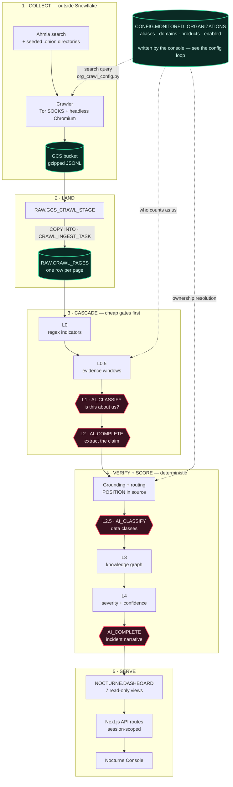
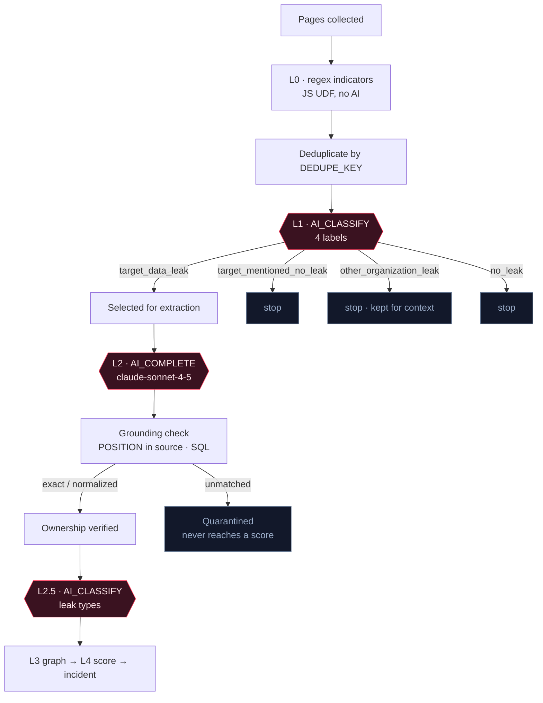
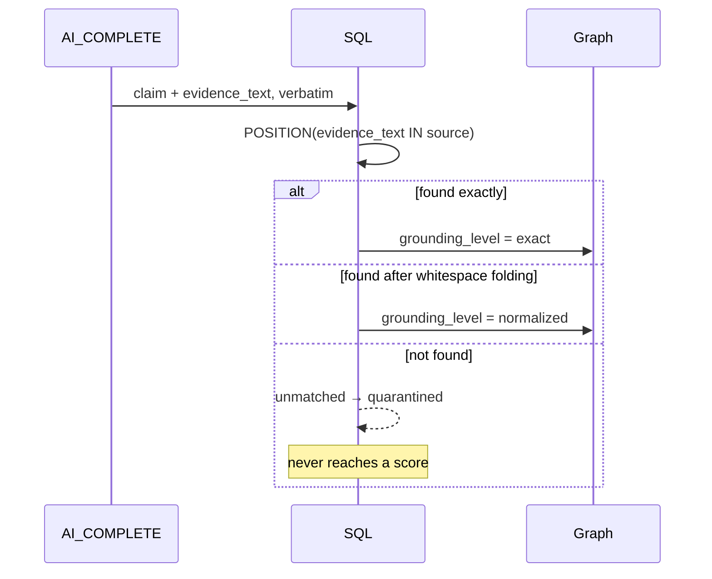
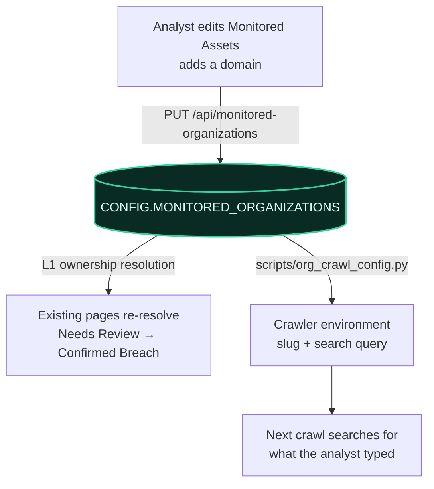
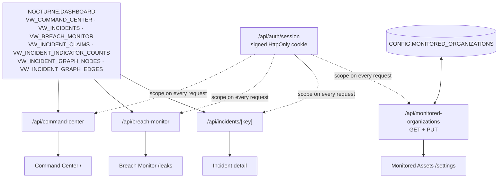

# Nocturne — architecture

How a page on a dark-web marketplace becomes a scored incident on an analyst's
screen, what is persisted at each hop, and exactly where AI is and is not used.

Every table, view and label name below was read from the SQL in `snowflake/`, not
from memory. Step numbers refer to the files `deploy_pipeline.py` applies in order.

Diagrams are committed as PNGs under `docs/architecture/` so they render anywhere.
The mermaid source sits under each one; regenerate with
`node scripts/render_diagrams.cjs` after editing it.

---

## 1. The whole system, end to end


<details>
<summary>Diagram source — mermaid</summary>



</details>

The dotted lines are the **config loop**, and it is the part most people miss: what
an analyst types into Monitored Assets decides what the crawler searches for, and
decides whether a page counts as "ours". More in §7.

---

## 2. Where the data comes from

**Source.** Ahmia's clearnet search index, queried through a headless Chromium
driven over a Tor SOCKS proxy, plus a handful of seeded `.onion` directory and
search entry points. The crawler follows `.onion` links out from those results.

**What one record contains.** URL, canonical URL, fetch timestamp, raw text, an
`ORG_ID` slug and a `CONTENT_SHA256` of the body.

**How it lands.** Records are buffered and written as bounded gzip-compressed JSONL
objects to a GCS bucket. Snowflake reads that bucket through an external stage
(`RAW.GCS_CRAWL_STAGE`) and `COPY INTO` loads them into `RAW.CRAWL_PAGES` on a task.

The crawler has **no Snowflake dependency**. It reads a slug and a search query from
its environment and writes files. That is deliberate — the collection tier can fail,
be rerun, or be replaced without touching the warehouse.

---

## 3. The cascade — why this is cheap

The whole design is one idea: **run the cheapest thing that can eliminate a page,
first.** Expensive model calls only ever see what survived.


<details>
<summary>Diagram source — mermaid</summary>



</details>

Roughly **6.7% of pages reach the expensive extraction step**. Everything above it is
regex, deduplication, or a cheap classifier. That ratio is the product's core
economic argument, and it is what the Detection Cascade chart on `/pipeline` shows.

Live volumes today are tiny — the warehouse has been seeded and crawled once — so
the demo numbers are small but the *shape* is real.

---

## 4. Where AI is used, and where it deliberately is not

Four AI call sites. Everything else is deterministic SQL.

| Step | Call            | Model                 | Question it answers                                   |
| ---- | --------------- | --------------------- | ----------------------------------------------------- |
| 08   | `AI_CLASSIFY` | Cortex                | Is this page about the organization we monitor?       |
| 09   | `AI_COMPLETE` | `claude-sonnet-4-5` | What exactly is being claimed, and quote the evidence |
| 11   | `AI_CLASSIFY` | Cortex                | What classes of data are exposed?                     |
| 14   | `AI_COMPLETE` | `claude-sonnet-4-5` | Write the analyst narrative for this incident         |

**Deliberately not AI:**

- **Ownership resolution.** Whether a domain belongs to the monitored org is decided
  by SQL against `CONFIG.MONITORED_ORGANIZATIONS`, not by a model.
- **Grounding verification.** The model returns `evidence_text` only. SQL locates it
  in the source with `POSITION()` and computes the offsets itself.
- **Scoring.** Impact, confidence and triage are weighted arithmetic (§6), fully
  auditable and reproducible.
- **Graph construction.** Nodes and edges are built by SQL from extracted items.

Each AI step writes to a **persistent results table** — `RELATIONSHIP_AI_RESULTS`,
`L2_EXTRACTION_AI_RESULTS`, `LEAK_TYPE_AI_RESULTS`, `INCIDENT_INSIGHT_AI_RESULTS` —
keyed so a page already processed is never paid for twice. The pattern throughout is
**candidate dynamic table → stream → triggered task → results table**, with tasks
gated on `SYSTEM$STREAM_HAS_DATA` so an idle pipeline holds no warehouse and costs
nothing.

### Prompt-injection isolation

These pages are written by adversaries and will contain instructions aimed at the
model. Two defences:

- **L1** sees a `TARGET PROFILE` and decides relevance. **L2** never sees the target
  at all — it receives a target-free `EVIDENCE_INPUT` window and cannot be told
  "this belongs to Acme."
- Indicator values are **replaced with `[REDACTED_INDICATOR]`** before the text
  reaches L2, so extracted evidence can never contain a live credential.

---

## 5. Grounding — the trust mechanism

This is the part worth demoing. The model is never trusted to assert a fact.


<details>
<summary>Diagram source — mermaid</summary>



</details>

A model that invents a quote produces text that is not in the source, `POSITION()`
returns nothing, and the claim is quarantined. **Hallucination becomes a detectable
event rather than a silent error.** The Evidence Quality tab on `/pipeline` shows the
quarantine reasons, with `unmatched_evidence` labelled as what it is.

---

## 6. Scoring — L4

Three scores per incident, all additive and auditable:

```
impact     = 0.60·data_sensitivity + 0.25·exposure_actionability + 0.15·record_scale
confidence = 0.35·ownership_evidence + 0.25·grounding + 0.20·claim_proof
             + 0.15·corroboration + 0.05·actor_credibility
triage     = 0.80·impact + 0.20·confidence
```

Missing optional inputs have their weight **normalized away**, never zeroed — an
incident is not penalised for a signal that was never available. The Score
Decomposition panel on an incident detail page renders these components directly.

---

## 7. The config loop

The one place the console writes back, and the thing that makes the demo a loop
rather than a line.


<details>
<summary>Diagram source — mermaid</summary>



</details>

Adding a domain in the UI changes what the crawler searches for **and** changes
whether existing pages resolve as yours. Snowflake grants for this are narrow by
design: `SELECT` on the dashboard views, `SELECT, UPDATE` on this one config table,
nothing else. The console can never create or delete a tenant — onboarding stays a
deliberate deployment step.

---

## 8. Identity keys

What makes a thing "the same thing" across the pipeline:

| Key                         | Scope                              | Purpose                                                                |
| --------------------------- | ---------------------------------- | ---------------------------------------------------------------------- |
| `ORG_ID`                  | tenant                             | In every downstream key — this is what enforces isolation             |
| `DOC_ID`                  | one fetched page                   | Provenance                                                             |
| `DEDUPE_KEY`              | a sighting                         | Same content at the same place; drives AI caching                      |
| `CONTENT_SHA256`          | body text                          | Same content**anywhere** — this is corroboration across mirrors |
| `NODE_KEY` / `EDGE_KEY` | graph                              | Entity and relationship identity                                       |
| `CLAIM_KEY`               | one extracted claim                | Deduplicates repeated claims                                           |
| `INCIDENT_KEY`            | `SHA2(ORG_ID ‖ CONTENT_SHA256)` | One incident per tenant per distinct leak                              |

`NODE_KEY` including `ORG_ID` is what blocks cross-tenant actor correlation today —
the same alias hashes differently per tenant. The additive fix is written up in
`nocturne_dashboard/docs/global-node-key.md`.

---

## 9. Where we present — the console


<details>
<summary>Diagram source — mermaid</summary>



</details>

**Step 16 is a contract, not a convenience.** The UI reads views, never pipeline
internals, so the cascade can be refactored without breaking the console. No raw
page text, no exact indicator values, no prompts and no raw AI payloads cross that
boundary — evidence is limited to already-masked text, and every view is `ORG_ID`
scoped.

**Tenant isolation is server-side.** The session cookie is signed HMAC; the API
re-derives role and scope from it on every request. An `ORG_USER` cannot widen scope
by passing an `orgId`; a `SUPER_ADMIN` may narrow to one tenant. The client's request
is a request, not a grant.

### Page inventory

| Live against Snowflake          | Still rendering fixtures    |
| ------------------------------- | --------------------------- |
| Command Center`/`             | Knowledge Graph`/graph`   |
| Breach Monitor`/leaks`        | Threat Actors`/actors`    |
| Incident detail`/leaks/[key]` | Pipeline`/pipeline`       |
| Monitored Assets`/settings`   | Fleet Command + 2 sub-pages |
|                                 | Organizations, Users        |

Current gaps, effort estimates and demo guidance live in
[`nocturne_dashboard/prod_requirement.md`](nocturne_dashboard/prod_requirement.md).

---

## 10. Reading order for the code

```
src/nocturne_crawler/scraper.py     collection
snowflake/02_ingestion_layer.sql    GCS → CRAWL_PAGES
snowflake/05_dt_regex_indicators.sql        L0
snowflake/07_dt_l1_classification_input.sql L0.5 evidence windows
snowflake/08_dt_relationship_classification.sql L1 · AI
snowflake/09_dt_l2_extraction_ai.sql            L2 · AI
snowflake/10_dt_l2_grounding_routing.sql    grounding — read this one
snowflake/11_dt_leak_type_severity.sql      L2.5 · AI
snowflake/12_dt_l3_knowledge_graph.sql      L3
snowflake/13_dt_l4_severity.sql             L4 scoring
snowflake/14_ai_incident_insights.sql       narrative · AI
snowflake/16_dashboard_interface.sql        the UI contract
nocturne_dashboard/src/server/nocturne-backend.ts   views → typed responses
```

If you read one file, read step 10. Grounding is the idea the rest of the system
exists to protect.
